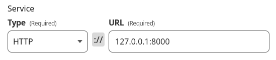

# Deploy a Gunicorn application using a Cloudflare tunnel

## Intro

I have a small mini PC at home with Linux installed. 

I have always wondered how to host my websites on this PC...

I once tried to point the DNS A record directly to the public IP address of my Mini PC. It did not work.

The problem had to do with my internet provider not allowing port forwarding. Or something like that.

Luckily Clouflare is there for us.

## Set up a Cloudflare account and domain

First of all, you need an accound. So, visit [Cloudflare and sign up](https://dash.cloudflare.com/). 

Then add your domain in Cloudflare. 

Enter your domain name down there:

Choose a plan. The free plan is enough for what we are trying to do.

And complete the domain registration just by adding the Cloudflare Nameservers to your domain Registar.

When done, the domain registration in Cloudflare can take some minutes or hours. So, meanwhile you can create the tunnel.

## Cloudflare Tunnel

Go to the _Zero Trust_ Overview. And click on _Acces > Tunnels_.

Once there, create your first tunnel. Click on _+ Create a tunnel_. Then enter the name. It does not matter which one, it should be a helpful name for yourself.

Then proceed with installing the Tunnel connector in your machine by selecting first you operating system.

This will install a service in your PC a token.

Check if your tunnel is active. Once it is active you can now connect your domains

## Gunicorn

Finally, you can add a public hostname in the tunnel and point it out to your gunicorn UNIX sock file (_/run/gunicorn.sock_).

In case your gunicorn is bind with a localhost and a port. For instance `gunicorn <--args> --bind 127.0.0.1:8000`, you can select the _http_ Service type in the hostname.

