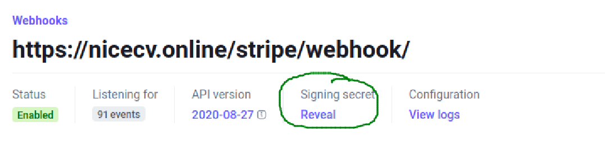

# How to solve the check djstripe.W005 is not populated in the db


You may have installed `dj-stripe`, and set up all the configuration in your Django setting module. But there is a warning check that irritates you. 

```shell
?: (djstripe.W005) The secret of Webhook Endpoint: DJSTRIPE_WEBHOOK_SECRET is not populated in the db. Events sent to it will not work properly.
	HINT: This can happen if it was deleted and resynced as Stripe sends the webhook secret ONLY on the creation call. Please use the django shell and update the secret ...

```


If you check out the source code of the check, [check_webhook_endpoint_has_secret](https://github.com/dj-stripe/dj-stripe/blob/master/djstripe/checks.py#L159), you notice that the secret property of the model object `WebhookEndpoint` is being checked.

## How to fix this

If you happen to have just one webhook instance, this will help you. 

1. First, make sure you have a `WebhookEndpoint` object in your admin site
2. Go to the Django command shell `python manage.py shell`

3. In the shell, run the following:

```python
from django.conf import settings
from djstripe.models import WebhookEndpoint

# Get the WebhookEndpoint object
e = WebhookEndpoint.objects.last() # Or e = WebhookEndpoint.objects.all()[0]

# Set the current secret and save
e.secret = setting.DJSTRIPE_WEBHOOK_SECRET
e.save()

```

_**Note:**_ If you wonder where to get the the Stripe Webhook secret, you need to visit the Stripe Dashboard, search for your webhook and click on _Reveal_ the _signing secret_.


