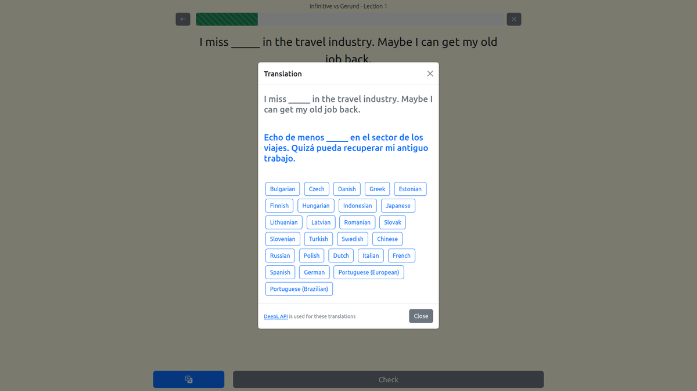
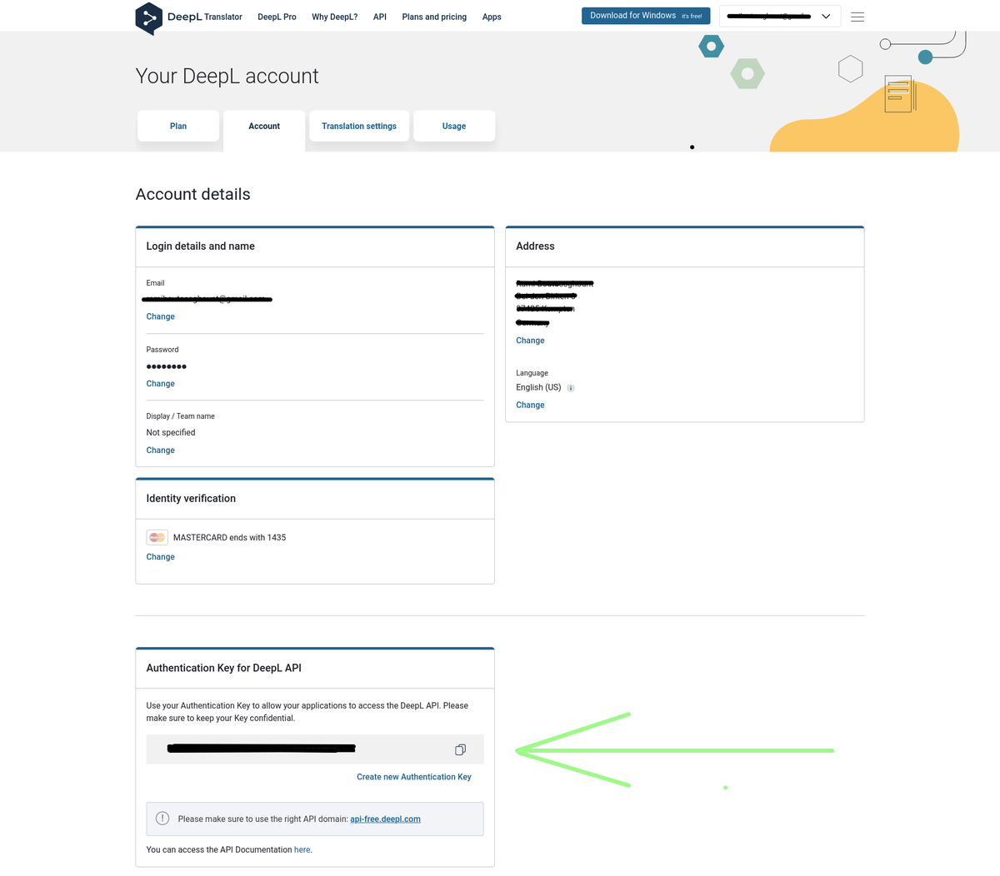

# Translations with DeepL API in a Django project

## Intro

DeepL Translator is an online translation service that provides accurate translations for any text input. They provide as well an API for automating our translations. In this post, we will take advantage of that service and translate a Django CharField of the Question model.

The Question model represents a simplified English quiz question from my website [englishstuff.online](https://www.englishstuff.online). Basically, when a user does not get the whole question, he can proceed as follows:

1. He clicks on the translation button
2. A modal will be displayed with the question text itself and all the languages available in DeepL.
3. He clicks on the target language.
4. Translation results are displayed in the same modal. See the following screenshot.



## Models

We define 3 models in order to make this work:

- The DeeplLanguage model represents the supported languages from DeepL ([See more in Deepl docs](https://www.deepl.com/docs-api/other-functions/listing-supported-languages/))
- The Question model represents the quiz question explained in the intro.
- The TranslatedQuestion model represents the translated question data.

```python

# myapp/models.py

from django.db import models

class DeeplLanguage(models.Model):
    name = models.CharField(max_length=50)
    code = models.CharField(max_length=5)
    supports_formality = models.BooleanField(default=False)

    def __str__(self) -> str:
        return self.name


class Question(models.Model):
    text = models.CharField(max_length=500)

    def __str__(self) -> str:
        return self.text


class TranslatedQuestion(models.Model):
    language = models.ForeignKey(
        DeeplLanguage,
        on_delete=models.CASCADE
        )
    question = models.ForeignKey(
        Question,
        on_delete=models.CASCADE
        )
    translated_text = models.CharField(max_length=650)

    def __str__(self) -> str:
        return self.original_text

```

## urls.py

In the _urls.py_ file, we capture the ids for Question and DeeplLanguage instances to be translated; a function-based view will be called.

```python
# myapp/urls.py

from django.urls import path

urlpatterns = [
    # other paths...

    # url for the question translation
    path(
        'translate/<int:id_question>/<int:id_language>/',
        views.translate_question_text,
        name='quiz_translate_question_text'
        ),
]

```

## Trigger that url path

In order to trigger that url path, we make use of the [htmx](https://htmx.org) attribute `hx-get`. In the question detail template, we`ve got the following:

```html
<!-- original text of the question -->
<h4 class="text-muted mt-2">{{ question.full_text }}</h4>

<!-- translated text location (and also to indicate that the user needs to select a language) -->
<h4 id="translated-text-here" class="text-warning mt-5">👇‍ Select language</h4>

<!-- getting al the DeeplLanguage objects available in our database -->
<div class="mt-5">
  
  <a
    hx-get=""
    hx-target="#translated-text-here"
    hx-swap="outerHTML"
    class="btn btn-outline-primary m-1"
    role="button"
    >{{ language_object.name }}</a
  >
  
</div>
```

The template tag `get_question_translation_url` can be defined in the app folder under _templatetags/question_related_tags.py_:

```python

from django import template
from django.urls import reverse
register = template.Library()


@register.simple_tag
def get_question_translation_url(id_language, id_question):
    return reverse(
        'quiz_translate_question_text',
        kwargs={'id_question': id_question, 'id_language': id_language}
        )


```

That function return the url and we can access within the Django template to the combination of question and language objects.

## DeepL account

In order to use the DeepL API, you need to create an account:

1. [Create an account](https://www.deepl.com/pro-checkout/account?productId=1200&yearly=false&trial=false) with the plan "DeepL API Free".
2. Follow their instructions until you account is activated
3. Go to your account details: [deepl.com/account/summary](https://www.deepl.com/account/summary?href=ramiboutas.com).
4. Save in a secure place the auth key. See the capture below.



## settings.py

I suggest you save your auth key under an .env file and you can read it in your Django project settings as follows:

```python
# proj/settings.py

import os

DEEPL_AUTH_KEY = os.environ.get('DEEPL_AUTH_KEY')
```

## Install deepl

The [DeepL library](https://pypi.org/project/deepl/) can make you save a lot of time. Install the library simply by doing, it is recommended that you use a virtual environment:

```bash
python -m pip install deepl
```

## views.py

In the view function, we get the language and question objects or throw a 404 if any of those instances do not exist.

If they exist, the code continues and we check first if that question has been translated into that language `TranslatedQuestion.objects.get(language=language, question=question)`. This can make us save some requests to the API. Otherwise, Django will throw the exception `TranslatedQuestion.DoesNotExist` and we capture it; here we make the API request.

The class deepl.Translator is initialized with our auth key (`settings.DEEPL_AUTH_KEY`) and we can translate the field question.text into the language.code just by calling the method `deepl.Translator.translate_text` . The translated text will be located in the Deepl function response under `result.text`.

```python
# myapp/views.py

# DeepL: https://pypi.org/project/deepl/
import deepl

# Django stuff
from django.shortcuts import render, get_object_or_404
from django.conf import settings

# our models:
from .models import DeeplLanguage, Question, TranslatedQuestion

def translate_question_text(request, id_question, id_language):
    language = get_object_or_404(DeeplLanguage, id=id_language)
    question = get_object_or_404(Question, id=id_question)

    try:
        translated_question = TranslatedQuestion.objects.get(language=language, question=question)

    except TranslatedQuestion.DoesNotExist:
        # https://github.com/DeepLcom/deepl-python
        translator = deepl.Translator(settings.DEEPL_AUTH_KEY)

        if language.supports_formality:
            result = translator.translate_text(question.text, target_lang=language.code, formality="less")

        else:
            result = translator.translate_text(question.text, target_lang=language.code)

        translated_question = TranslatedQuestion.objects.create(language=language, question=question, translated_text = result.text)

    context = {'translated_text': translated_question.translated_text}
    return render(request, 'quiz/partials/question_translated_text.html', context)
```

## Render result in template

Finally, we render the result in an HTML fragment and respond to the request.

```html
<h4 id="translated-text-here" class="text-primary mt-5">
  {{ translated_text }}
</h4>
```

In our case, the partial template _quiz/partials/question_translated_text.html_ is just that HTML code since we use [htmx](https://htmx.org) to insert the rendered HTML with the translated result into the DOM.

## Source code

You can find the whole source code under my GitHub repo: [englishquiz](https://github.com/ramiboutas/englishquiz)

Enjoy translating with no effort,
